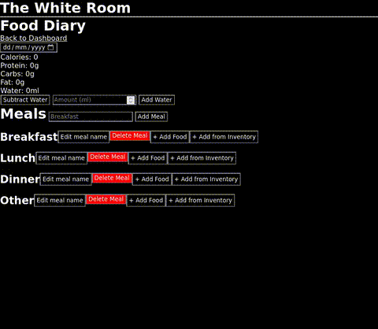
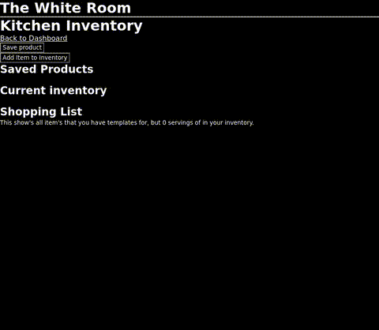
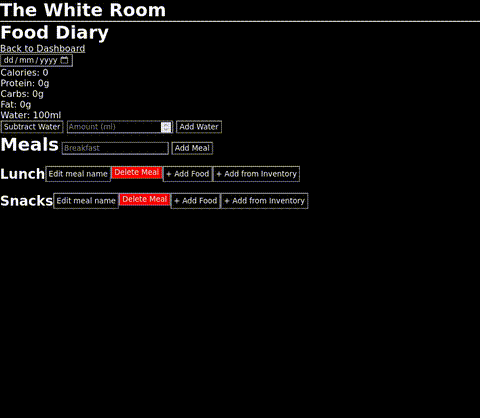
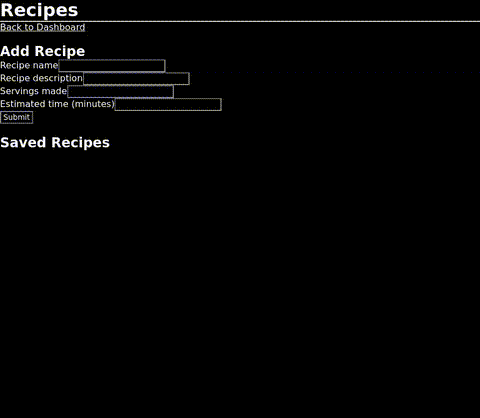
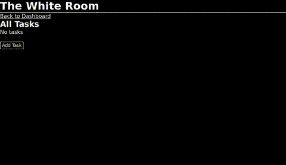
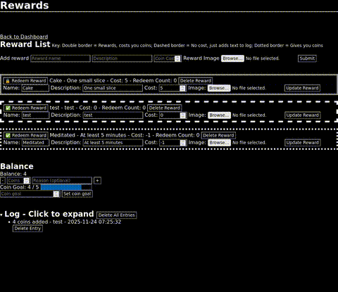
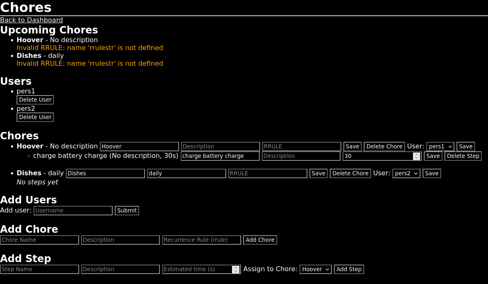
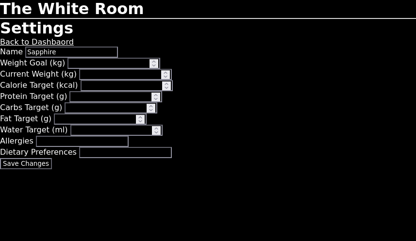

# The White Room
> An all-in-one Self Management Framework

Live Demo: http://46.101.90.169:5000/dashboard

Has features for calories and macro tracking, water tracking, kitchen inventory tracking (Product details including calories and macros per serving and per 100g and price and purchase location and price per item and servings per item and whether it is a tool or not also it generates a shopping list based on what you have in your inventory and saved products), recipe saving using saved products (not very good yet but it's not done), task management with name, description, and due dates as well as marking as complete or incomplete, self reward system with rewards, punishments, and log entries that don't affect coin balance, interval timers page that allow you to add multiple timers for different breaks, multi user chore management system with steps for the chores and RRULEs for repetition of the chores (work in progress, needs a GUI for generating the RRULEs behind the scene for you), settings page to change saved user data from initial setup page.


# Features
## New
### Meditation
A timer that supports playing custom audios at the start, end, and at **customisable** time intervals. Can also be used to make things like custom couch to 5k routines with custom voices such as TTS or anything else the user can imagine.


## Older
### Routes
A tree of tasks, habits, routines and resources that guide the user on a self guided mastery of certain skills. The user can make any custom tree but the primary use case is for people to progressively overload skills much in the same way they would with weights in a gym. For example a "mindfulness" tree might start with a habit of 1 minute a day of meditation and a resource such as a link to a YouTube video of why you should practice meditating. This can be expanded for anything such as musical instruments, languages or chess/go/shogi, anything the user can imagine to create a plan for themselves.


What I actually managed to implement so far:
- Add route (name and description)
- Add nodes ("steps") to the routes (name, type(doesn't do anything yet), content)
- Display routes and their steps
- Delete steps
- Delete routes

### Routes
- Placeholder pages for meditation, runs and weightlifting

## Older
### Food Diary


### Kitchen Inventory


#### Food Diary Demo 2
Now that there is items in kitchen inventory you can add them to food diary

Adding it to your inventory decrements the quantity added from the amount left in your inventory.

### Recipes

Work in progress, in the future it will be able to calculate an estimation for the calories and macros of the recipe based on the details saved about the ingredients in kitchen inventory. It will also be able to just add an instance of the recipe to your inventory and from there to your food diary with those calculated calories and macros, and if you made multiple servings then you can easily add it to food diary once you eat the other serving in 3 clicks. 

### Tasks


### Self Reward System

  
Need to update logic to change "-5 coins spent" to "added 5 coins".
Not shown: Reward images

### Interval Timers
Not fully working, requires updates

### Chores


### Settings
Change data from initial setup page

<!--
## Planned
-->

## Self-Hosting Guide
install python if you don't have it  

```sh
git clone https://github.com/shania-codes/thewhiteroom  
cd thewhiteroom  

Windows: python -m venv venv  
macOS/Linux: python3 -m venv venv  


Windows: 
venv\Scripts\activate  
macOS/Linux:
source venv/bin/activate  


pip install flask python-dateutil  

flask run  
```
Visit: http://YourServerIP:5000/  
