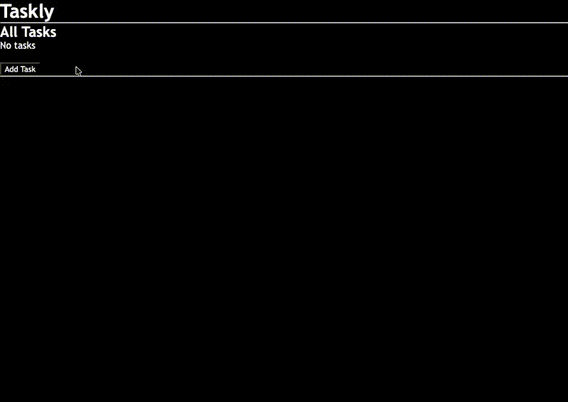
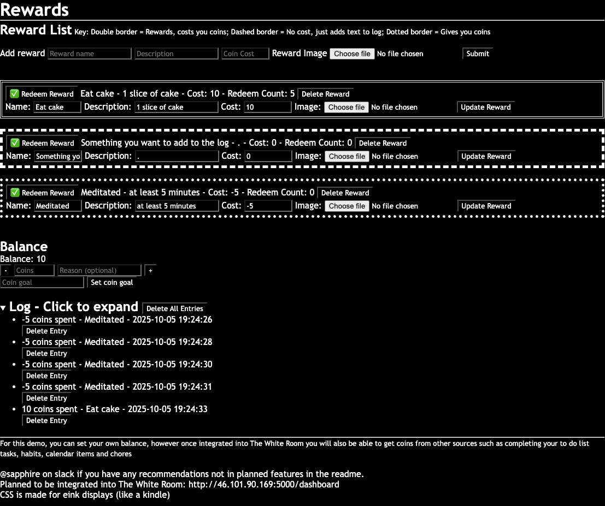
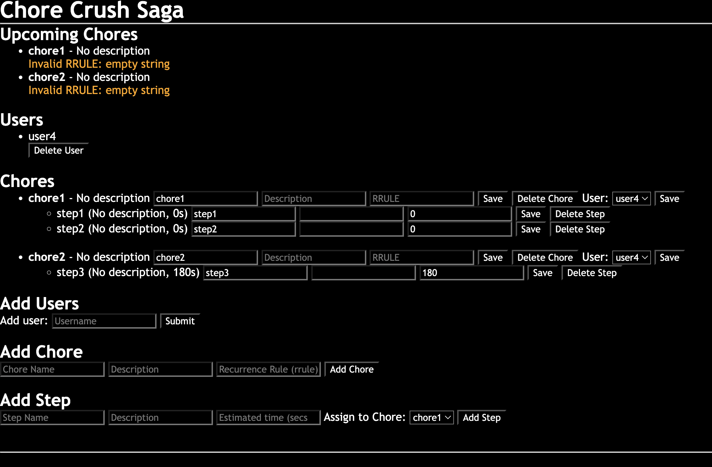

# The White Room
> An all-in-one Self Management Framework

Has features for calories and macro tracking, water tracking, kitchen inventory tracking (Product details including calories and macros per serving and per 100g and price and purchase location and price per item and servings per item and whether it is a tool or not also it generates a shopping list based on what you have in your inventory and saved products), recipe saving using saved products, task management with name description and due dates and marking as complete or incomplete, Innovative self reward system with rewards, punishments, and neutral entries that don't change coin balance but save a message to the log, multiple interval timers page that allow you to add multiple timers for different breaks, multi user chore management system with steps for the chores and RRULEs for repetition of the chores, settings page to change saved user data from initial setup page.
<!-- TODO Rewrite the above section to be below the older features sub headings and also add any missing demos and update the other demos -->

# Features
## New
### Plan Trees
A tree of tasks, habits, routines and resources that guide the user on a self guided mastery of certain skills. The user can make any custom tree but the primary use case is for people to progressively overload skills much in the same way they would with weights in a gym. For example a "mindfulness" tree might start with a habit of 1 minute a day of meditation and a resource such as a link to a YouTube video of why you should practice meditating. This can be expanded for anything such as musical instruments, languages or chess/go/shogi, anything the user can imagine to create a plan for themselves.


## Older
### Food Diary
### Kitchen Inventory
### Recipes
### Tasks

### Self Reward System

### Interval Timers
### Chores

### Settings
Change data from initial setup page
<!--
## Planned
-->

## Self-Hosting Guide
install python if you don't have it  

```sh
git clone https://github.com/shania-codes/thewhiteroom  
cd thewhiteroom  

Windows: python -m venv venv  
macOS/Linux: python3 -m venv venv  


Windows: 
venv\Scripts\activate  
macOS/Linux:
source venv/bin/activate  


pip install flask python-dateutil  

flask run  
```
Visit: http://YourServerIP:5000/  